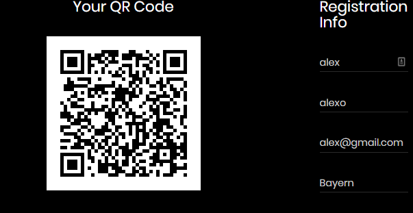
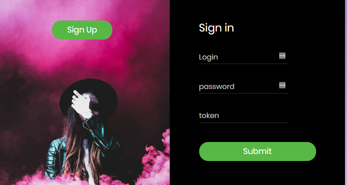

# LoginTwoFactorAuth
#### in this project , i created login/sign Up ASP.NET Web project with implementing WCF service that implements the generation of preshared key and verifies the token that is generated after scanning the QrCode with Google Authenticator

